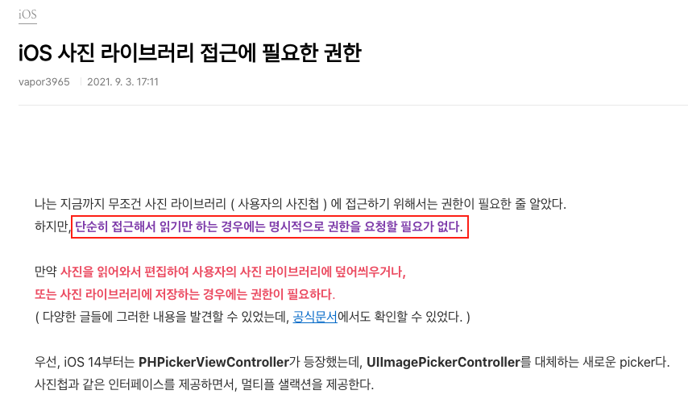

# My Gallery

| 일반 | 폴드 |
|------|------|
|  |  |

갤러리 프로젝트입니다.

## 프로젝트 소개

사용자가 디바이스의 내장 갤러리에서 사진을 선택하여 커스텀 앨범으로 관리할 수 있는 갤러리 앱입니다. 일반 스마트폰과 폴드폰의 화면 크기를 고려한 반응형 디자인을 적용했습니다.

## 주요 기능

### 1. 내장 갤러리 사진 선택
- **ImagePicker API**를 사용하여 디바이스 갤러리에서 사진 선택
- 갤러리에서 기존 사진 선택 가능

### 2. 앨범별 사진 관리
- **커스텀 DropDownPicker** 구현으로 앨범 선택 및 생성
- 앨범별로 사진을 분류하여 체계적인 관리 가능

### 3. 이미지 상세 보기
- 사진을 탭하면 **전체화면 모달**로 큰 이미지 확인
- 직관적인 UI/UX 제공

### 4. 모달 내 사진 네비게이션
- 모달 내에서 좌우이동
- 이전/다음 화살표 버튼으로도 조작 가능

### 5. 데이터 영구 저장
- **AsyncStorage**를 활용한 로컬 데이터 저장
- 앱 재시작 후에도 앨범과 사진 데이터 유지

### 6. 반응형 그리드 레이아웃
- **일반 스마트폰**: 3열 그리드
- **폴드폰 (펼친 상태)**: 5열 그리드
- 화면 크기에 따른 동적 컬럼 수 조정

## 📁 프로젝트 구조

```
src/
├── components/           # 재사용 가능한 UI 컴포넌트
│   ├── BigImgModal.tsx      # 이미지 전체보기 모달
│   ├── GallaryRenderItem.tsx # 갤러리 아이템 렌더러
│   ├── ImageList.tsx        # 이미지 리스트 컴포넌트
│   ├── MyDropDownPicker.tsx # 커스텀 드롭다운 피커
│   └── TextInputModal.tsx   # 텍스트 입력 모달
├── hooks/                # 커스텀 훅
│   ├── useGallary.ts        # 갤러리 관련 로직
└── utils/                # 유틸리티 함수
    └── screenUtils.ts       # 화면 크기 계산 유틸
```

## 주요 구현 사항

### 반응형 그리드 시스템
```typescript
// 화면 크기에 따른 동적 컬럼 계산
const calculateNumColumns = () => {
  const screenWidth = Dimensions.get('window').width;
  if (screenWidth < 500) return 3;      // 일반 폰
  if (screenWidth < 700) return 4;      // 큰 폰
  if (screenWidth < 900) return 5;      // 폴드폰
  return 6;                             // 태블릿
};
```

### KeyboardAvoidingView 키보드 대응
```typescript
// OS별 키보드 회피 설정
const behavior = Platform.OS === "ios" ? "padding" : "height";
const keyboardVerticalOffset = Platform.OS === "ios" ? 0 : 60;
```
- iOS와 Android에서 키보드 동작이 달라 `keyboardVerticalOffset`을 OS별로 다르게 설정

## 학습 목표 달성

이 프로젝트를 통해 다음과 같은 React Native 개발 역량을 습득했습니다:

- ✅ Expo 환경에서의 React Native 앱 개발
- ✅ 디바이스 API (ImagePicker) 활용
- ✅ 로컬 데이터 저장소 (AsyncStorage) 관리
- ✅ 커스텀 컴포넌트 및 훅 개발
- ✅ 갤러리 화면 크기 대응
- ✅ TypeScript를 활용한 타입 안정성 확보
- ✅ 모달 개발(DropDownPicker, 이미지 확대)

<br><br><br>

# 갤러리 API 사용시 권한이 뜨지 않는 이유(Android)
  
## 📷 Android에서 갤러리 접근 방식 정리 (권한 모델 변화)

### 1. 시스템 갤러리 UI (Photo Picker API)

- Android 13 (2022년 8월 출시)부터 **Photo Picker API**가 도입됨
- 시스템에서 제공하는 사진 선택 UI를 통해 사용자가 사진을 선택
- **권한 요청 없이도 사용 가능**
- 앱은 **사용자가 선택한 사진만 접근 가능** (전체 갤러리 접근 불가)

> 📌 대표 사용 예시: 프로필 사진 선택, 게시물에 사진 첨부 등

---

### 2. 전체 이미지 접근 (코드 기반 쿼리 방식)

- 앱이 **전체 이미지 목록을 쿼리하거나 자동으로 로딩**하려면,
  - `MediaStore`, `expo-media-library` 등을 통해 직접 접근해야 함
- 이 경우에는 반드시 다음 조건을 충족해야 함:
  - `AndroidManifest.xml`에 권한 선언
  - 앱 실행 중 유저에게 권한 요청
  - 유저가 권한을 허용해야만 접근 가능

> ❗ 시스템 UI가 아니라, 코드에서 이미지 파일들을 직접 읽어오는 방식

---

### 3. 권한 종류 및 적용 범위

| Android 버전 | 이미지 접근 권한 | 설명 |
|--------------|------------------|------|
| Android 12 이하 | `READ_EXTERNAL_STORAGE` | 외부 저장소의 이미지 포함 모든 미디어 접근 |
| Android 13 이상 | `READ_MEDIA_IMAGES` | 이미지 파일만 접근 가능<br>`READ_EXTERNAL_STORAGE`는 무시됨 |
| Android 13 이상 | `READ_MEDIA_VIDEO`, `READ_MEDIA_AUDIO` | 각각 비디오, 오디오 파일 접근용 권한 |

> `READ_MEDIA_IMAGES`는 **Android 13부터 새로 도입된 권한이며**, `READ_EXTERNAL_STORAGE`를 이미지 접근 용도로 **대체합니다.**

---

### ✅ 결론

- **Photo Picker API**는 **시스템 UI를 통해 선택된 사진만** 앱에 전달되며, **권한 요청이 필요 없음**
- **전체 이미지에 접근하려면** `READ_MEDIA_IMAGES` 권한을 **AndroidManifest.xml에 선언하고, 유저에게 명시적 동의를 받아야 함**
- Android 13부터는 `READ_EXTERNAL_STORAGE`가 **이미지 접근 용도로는 더 이상 유효하지 않음**
- Android 12이하에서 시스템 UI가 아니더라도 갤러리 앱을 통해 이미지게 접근하는 경우 권한이 필요하지 않음

<br> <br>
# iOS 갤러리 관련

## 📷 iOS에서 사진 접근 방식

iOS에서 사진 접근은 크게 2가지 방식으로 나뉩니다:

---

### 1. PHPickerViewController (iOS 14+)

- 시스템에서 제공하는 사진 선택 UI를 사용
- **권한 없이 사용 가능**  
- 사용자가 선택한 사진만 앱에 전달됨
- https://vapor3965.tistory.com/94
- 공식문서 https://developer.apple.com/documentation/photokit/delivering-an-enhanced-privacy-experience-in-your-photos-app


---

### 2. PHPhotoLibrary (전체 라이브러리 접근)

- 코드로 전체 사진 라이브러리를 직접 불러오는 방식  
- **권한 필요**  
- 앱 최초 실행 시 유저에게 다음 옵션을 선택하도록 요청함:  
  - 모든 사진 허용  
  - 선택된 사진만 허용  
  - 접근 거부  
