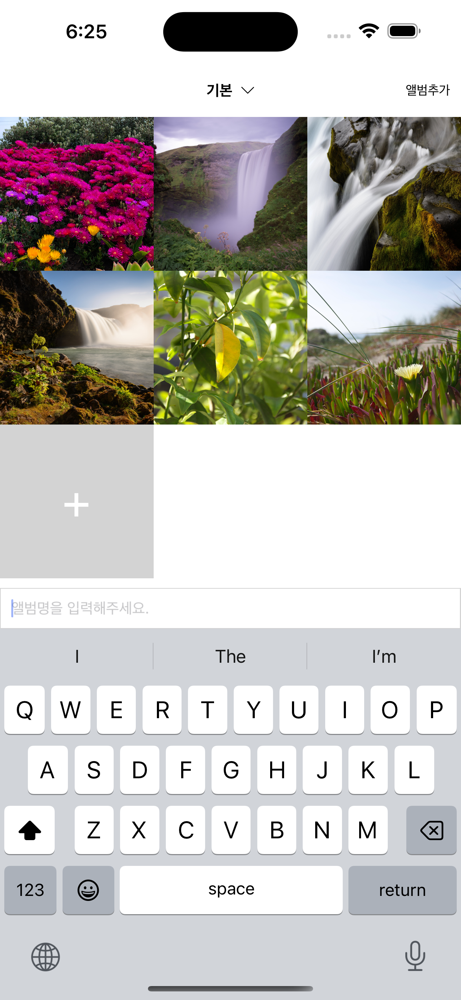
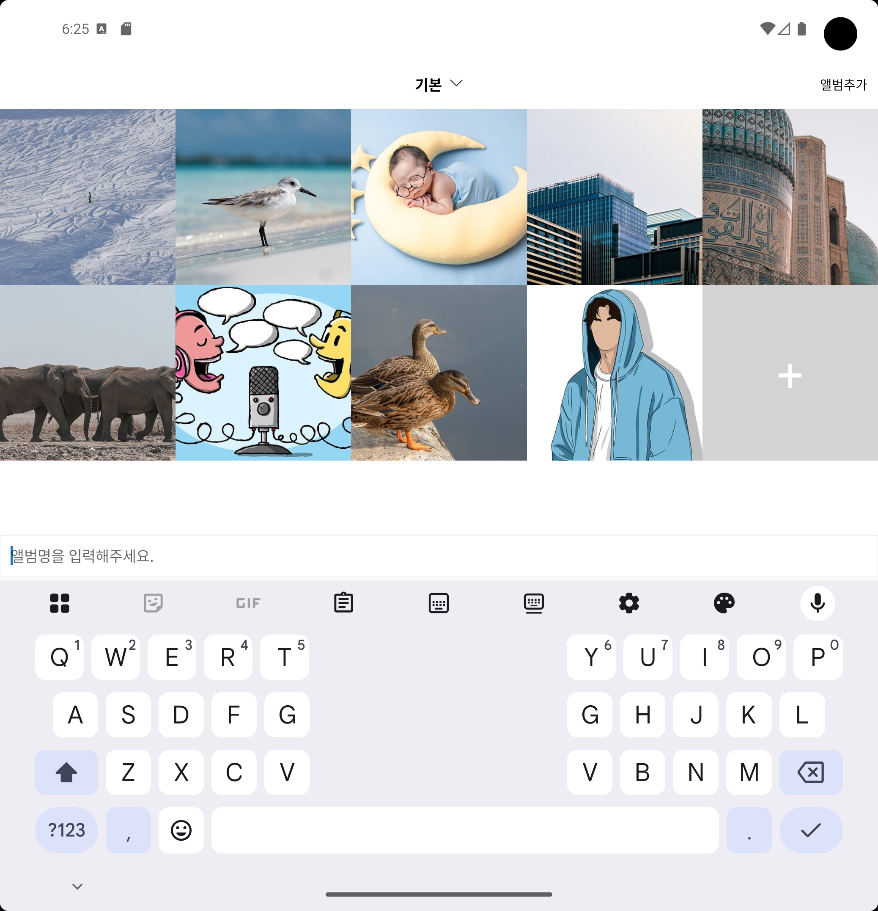

# My Gallery

| 일반 | 폴드 |
|------|------|
|  |  |

갤러리 프로젝트입니다.

## 프로젝트 소개

사용자가 디바이스의 내장 갤러리에서 사진을 선택하여 커스텀 앨범으로 관리할 수 있는 갤러리 앱입니다. 일반 스마트폰과 폴드폰의 화면 크기를 고려한 반응형 디자인을 적용했습니다.

## 주요 기능

### 1. 내장 갤러리 사진 선택
- **ImagePicker API**를 사용하여 디바이스 갤러리에서 사진 선택
- 갤러리에서 기존 사진 선택 가능

### 2. 앨범별 사진 관리
- **커스텀 DropDownPicker** 구현으로 앨범 선택 및 생성
- 앨범별로 사진을 분류하여 체계적인 관리 가능

### 3. 이미지 상세 보기
- 사진을 탭하면 **전체화면 모달**로 큰 이미지 확인
- 직관적인 UI/UX 제공

### 4. 모달 내 사진 네비게이션
- 모달 내에서 좌우이동
- 이전/다음 화살표 버튼으로도 조작 가능

### 5. 데이터 영구 저장
- **AsyncStorage**를 활용한 로컬 데이터 저장
- 앱 재시작 후에도 앨범과 사진 데이터 유지

### 6. 반응형 그리드 레이아웃
- **일반 스마트폰**: 3열 그리드
- **폴드폰 (펼친 상태)**: 5열 그리드
- 화면 크기에 따른 동적 컬럼 수 조정

## 📁 프로젝트 구조

```
src/
├── components/           # 재사용 가능한 UI 컴포넌트
│   ├── BigImgModal.tsx      # 이미지 전체보기 모달
│   ├── GallaryRenderItem.tsx # 갤러리 아이템 렌더러
│   ├── ImageList.tsx        # 이미지 리스트 컴포넌트
│   ├── MyDropDownPicker.tsx # 커스텀 드롭다운 피커
│   └── TextInputModal.tsx   # 텍스트 입력 모달
├── hooks/                # 커스텀 훅
│   ├── useGallary.ts        # 갤러리 관련 로직
└── utils/                # 유틸리티 함수
    └── screenUtils.ts       # 화면 크기 계산 유틸
```

## 주요 구현 사항

### 반응형 그리드 시스템
```typescript
// 화면 크기에 따른 동적 컬럼 계산
const calculateNumColumns = () => {
  const screenWidth = Dimensions.get('window').width;
  if (screenWidth < 500) return 3;      // 일반 폰
  if (screenWidth < 700) return 4;      // 큰 폰
  if (screenWidth < 900) return 5;      // 폴드폰
  return 6;                             // 태블릿
};
```

### KeyboardAvoidingView 키보드 대응
```typescript
// OS별 키보드 회피 설정
const behavior = Platform.OS === "ios" ? "padding" : "height";
const keyboardVerticalOffset = Platform.OS === "ios" ? 0 : 60;
```
- iOS와 Android에서 키보드 동작이 달라 `keyboardVerticalOffset`을 OS별로 다르게 설정

## 학습 목표 달성

이 프로젝트를 통해 다음과 같은 React Native 개발 역량을 습득했습니다:

- ✅ Expo 환경에서의 React Native 앱 개발
- ✅ 디바이스 API (ImagePicker) 활용
- ✅ 로컬 데이터 저장소 (AsyncStorage) 관리
- ✅ 커스텀 컴포넌트 및 훅 개발
- ✅ 갤러리 화면 크기 대응
- ✅ TypeScript를 활용한 타입 안정성 확보
- ✅ 모달 개발(DropDownPicker, 이미지 확대)

---